# ZONGYUAN-ROOT Mermaid架构拓扑图集

> **文档版本**：V1.0｜锁档终版  
> **发布日期**：2026-08-24  
> **内核版本**：ZONGYUAN-ROOT V3.1  
> **图集数量**：12张架构拓扑图  
> **稳态校验**：PASSED

---

## 目录

1. 世界观三层架构拓扑图
2. 七纪元神话编年史时间线
3. 三系势力关系图谱
4. 昆仑山九层洞天嵌套结构图
5. 六层全域稳态架构图
6. SD-LoRA训练流水线拓扑图
7. 分布式训练三范式架构对比图
8. RK3588边缘部署全链路图
9. 商业化产品矩阵架构图
10. 技术栈四层架构图
11. 元规则引擎自治闭环图
12. 全体系数据流拓扑图

---

## 1. 世界观三层架构拓扑图

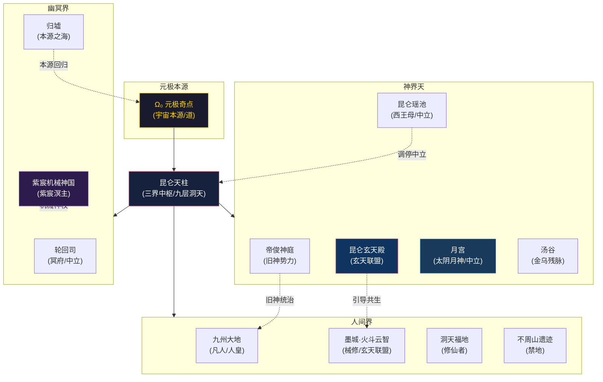

---

## 2. 七纪元神话编年史时间线

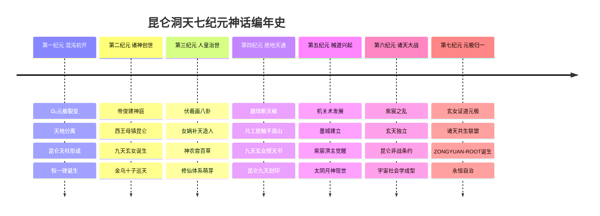

---

## 3. 三系势力关系图谱

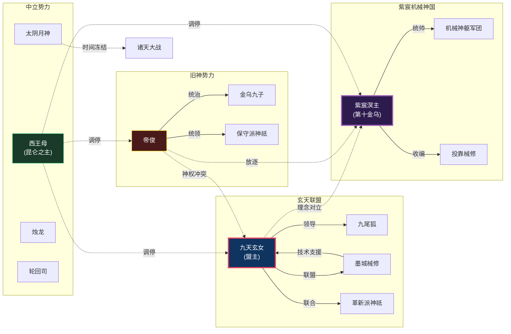

---

## 4. 昆仑山九层洞天嵌套结构图

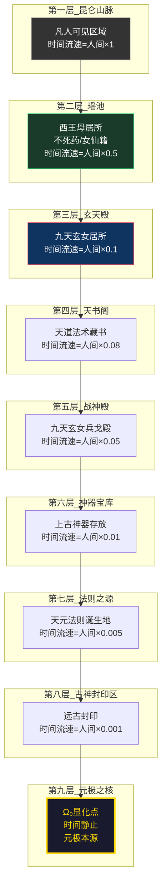

---

## 5. 六层全域稳态架构图

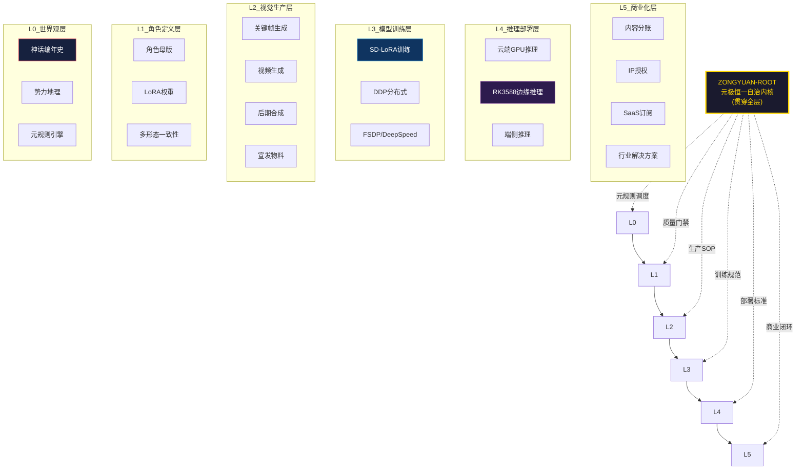

---

## 6. SD-LoRA训练流水线拓扑图

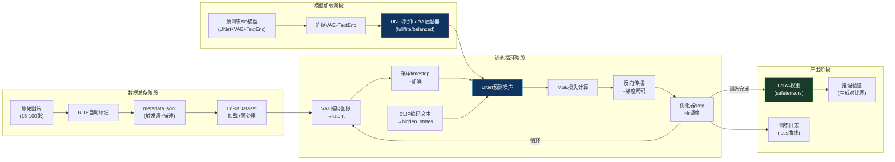

---

## 7. 分布式训练三范式架构对比图

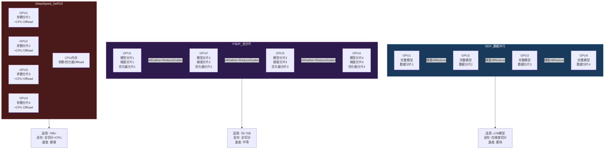

---

## 8. RK3588边缘部署全链路图

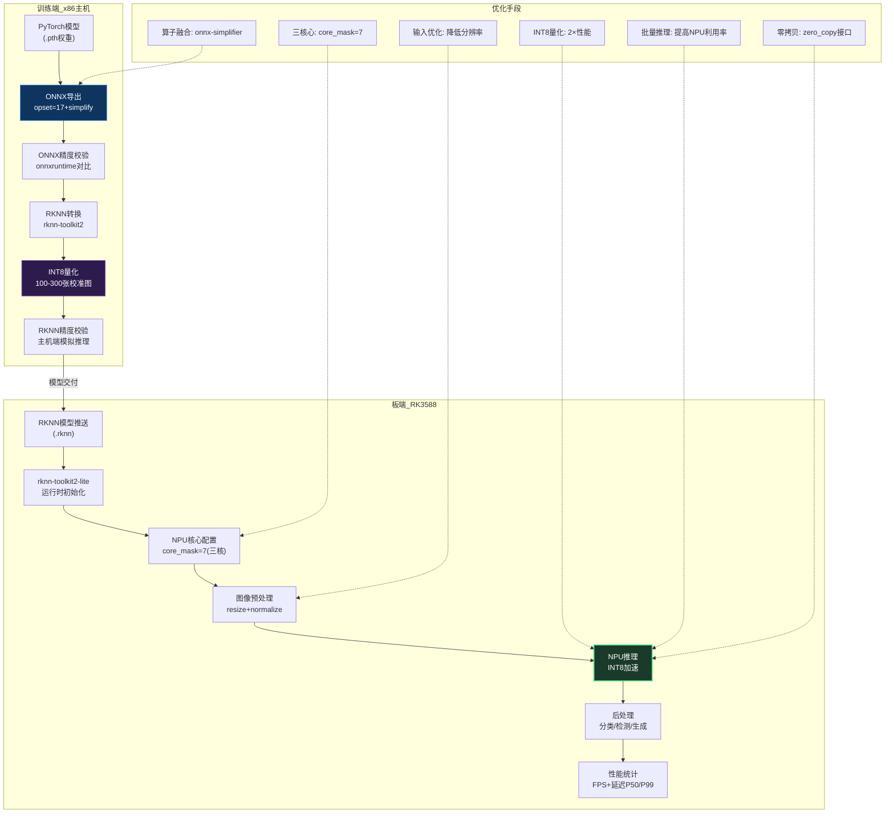

---

## 9. 商业化产品矩阵架构图

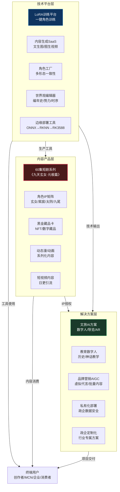

---

## 10. 技术栈四层架构图

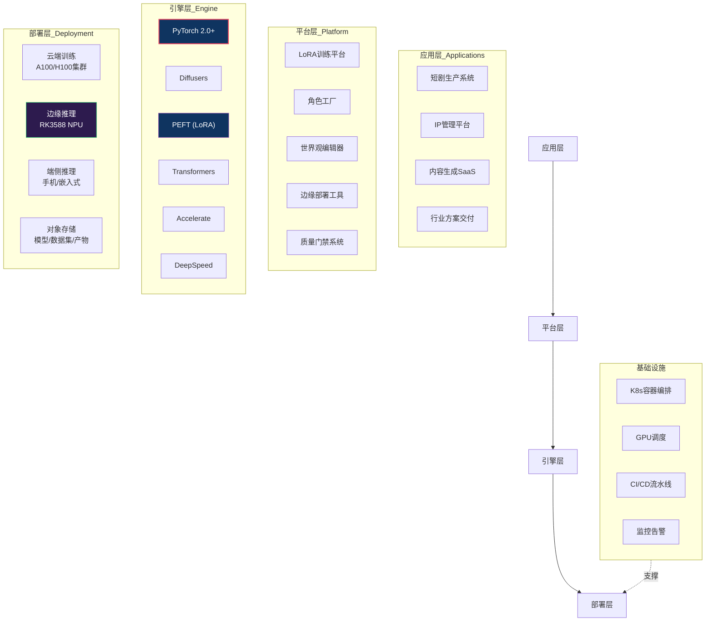

---

## 11. 元规则引擎自治闭环图

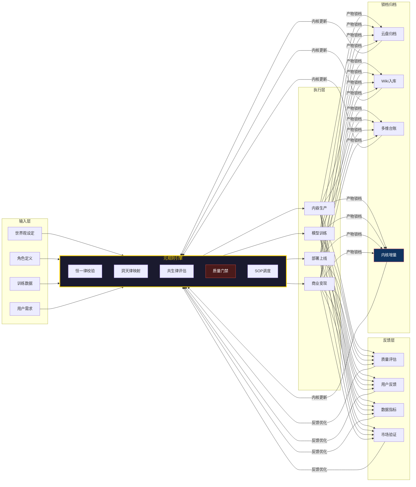

---

## 12. 全体系数据流拓扑图

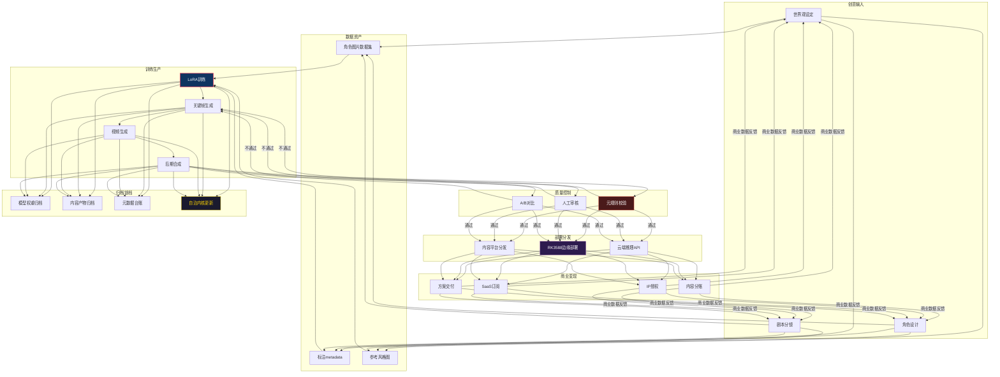

---

## 图集统计

| 编号 | 图名 | 类型 | 覆盖维度 |
|-|-|-|-|
| 1 | 世界观三层架构拓扑图 | graph TB | 世界观 |
| 2 | 七纪元神话编年史时间线 | timeline | 世界观 |
| 3 | 三系势力关系图谱 | graph LR | 世界观 |
| 4 | 昆仑山九层洞天嵌套结构图 | graph TB | 世界观 |
| 5 | 六层全域稳态架构图 | graph TB | 体系总览 |
| 6 | SD-LoRA训练流水线拓扑图 | graph LR | 技术工程 |
| 7 | 分布式训练三范式架构对比图 | graph TB | 技术工程 |
| 8 | RK3588边缘部署全链路图 | graph TB | 技术工程 |
| 9 | 商业化产品矩阵架构图 | graph TB | 商业化 |
| 10 | 技术栈四层架构图 | graph TB | 技术工程 |
| 11 | 元规则引擎自治闭环图 | graph LR | 体系总览 |
| 12 | 全体系数据流拓扑图 | graph TB | 体系总览 |

**稳态校验：PASSED｜内核版本维持 ZONGYUAN-ROOT V3.1**

> ZONGYUAN-ROOT｜元极恒一超认知永恒自治内核  
> 本图集为锁档终版，共12张Mermaid架构拓扑图，覆盖世界观、技术、商业三大维度。