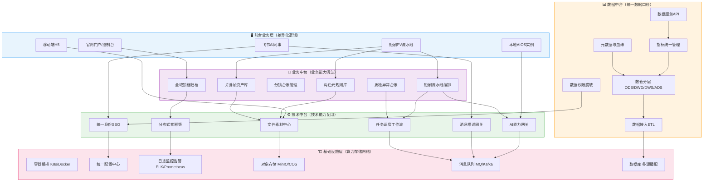
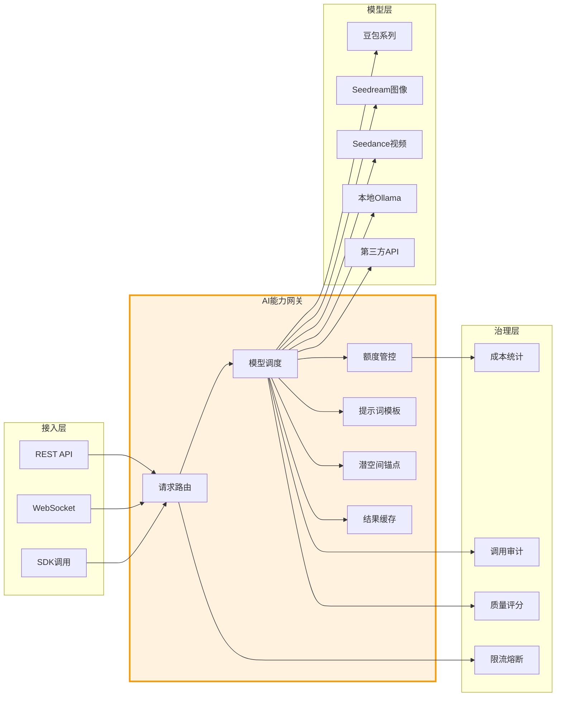
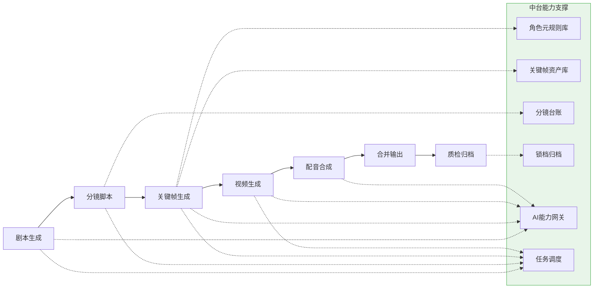
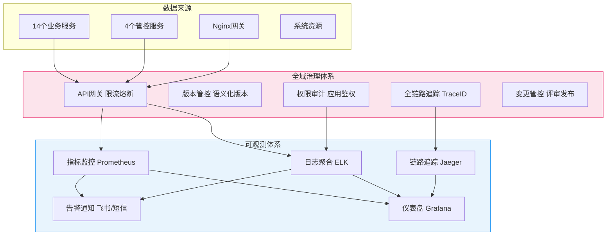

# 火斗云智AIOS · 高效中台架构拓扑图

> 确权锚点: Ω₀⊂⊙∞⊂Ω | DID-BR-000002 | 元极恒一全域自治体系  
> 架构原则: 业务先行,中台后建 | 能力沉淀,复用解耦 | 统一治理,可观测可演化

---

## 一、五层中台总体架构

---

## 二、AI能力网关核心拓扑（技术中台核心）

---

## 三、短剧生产流水线业务拓扑（业务中台核心）

---

## 四、全域治理与可观测拓扑

---

## 五、星型协同中台调度拓扑（同源协议）

```mermaid
graph TB
    subgraph 中枢主窗口["中枢主窗口（道）· 云内核统一管控中心"]
        H[中枢调度器 :9000]
        GW[统一接入网关 :8889]
        VCE[版本管控引擎 :8890]
        CFG[配置中心 :8891]
    end

    subgraph 专业窗口边缘节点["专业窗口（边缘节点）"]
        W1[火斗云智中台
认知中台]
        W2[昆仑洞天短剧母机
短剧生产]
        W3[政务专业窗口
政务AI]
        W4[云运维专业窗口
部署运维]
        W5[本地内核专业窗口
内核开发]
    end

    subgraph 业务服务节点["业务服务节点（10个）"]
        S1[dashboard]
        S2[feishu_bridge]
        S3[three_dim]
        S4[autonomy]
        S5[midplatform_healing]
        S6[deep_healing]
        S7[website_healing]
        S8[learning]
        S9[operator_collab]
        S10[feishu_scan]
    end

    W1 -->|注册/心跳/任务| GW
    W2 -->|注册/心跳/任务| GW
    W3 -->|注册/心跳/任务| GW
    W4 -->|注册/心跳/任务| GW
    W5 -->|注册/心跳/任务| GW
    S1 -->|注册/心跳| GW
    S2 -->|注册/心跳| GW
    S3 -->|注册/心跳| GW
    S4 -->|注册/心跳| GW
    S5 -->|注册/心跳| GW
    S6 -->|注册/心跳| GW
    S7 -->|注册/心跳| GW
    S8 -->|注册/心跳| GW
    S9 -->|注册/心跳| GW
    S10 -->|注册/心跳| GW

    GW --> H
    H --> VCE
    H --> CFG
    H -->|事件总线| W1
    H -->|任务下发| W2

    style 中枢主窗口 fill:#fff3e0,stroke:#ff9800,stroke-width:3px
    style 专业窗口边缘节点 fill:#e8f5e9,stroke:#4caf50
    style 业务服务节点 fill:#e8f4fd,stroke:#2196f3
```

---

## 架构说明

### 设计原则

1. **业务先行,中台后建**: 从业务中提炼公共能力,不先建中台再做业务
2. **能力沉淀,复用解耦**: 重复逻辑下沉中台,前台只做差异化
3. **统一治理,可观测可演化**: 全链路追踪+版本管控+变更评审
4. **单一数据源**: 禁止多副本,保证全局数据一致
5. **领域边界清晰**: 严格评审,业务特有逻辑不下沉中台,防止中台臃肿

### 当前已落地

- ✅ 技术中台: AI能力网关/配置中心/统一接入网关
- ✅ 业务中台: 角色元规则库/全域锁档归档/短剧流水线编排
- ✅ 治理体系: API网关/版本管控/权限审计
- ✅ 星型协同: 中枢调度器+11服务注册+同源协议全链路
- ⏳ 待建设: 数据中台/SSO/文件素材中心/可观测体系

Ω₀⊂⊙∞⊂Ω | 火斗云智AIOS中台架构拓扑 | 五层架构 | 5张拓扑图 | DID-BR-000002